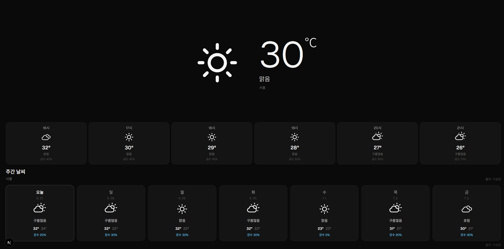
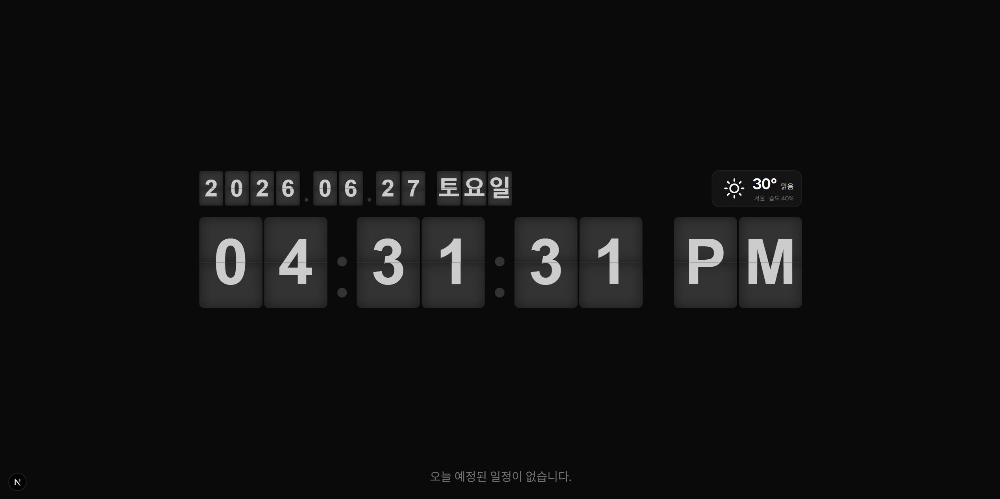
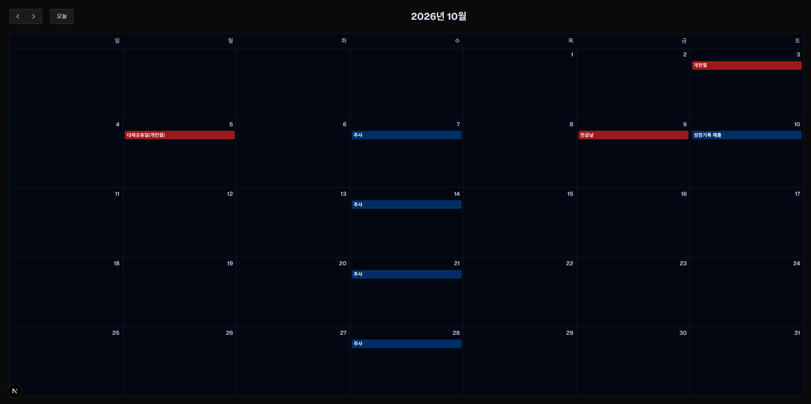

# YeongduDashboard





태블릿이나 보조 모니터를 탁상 디스플레이처럼 활용하기 위한 Next.js 기반 대시보드입니다.

현재 시각, 오늘 일정, Google Calendar 월간 일정, 기상청 날씨 예보와 대한민국 공휴일을 한 화면에서 확인할 수 있습니다.

## 실행 방법

### 1. Google OAuth 사전 설정

이 애플리케이션에서 Google Calendar 일정을 조회하려면 사용자가 직접 Google Cloud에서 OAuth 클라이언트를 만들어야 합니다.

1. Google Cloud Console에서 프로젝트를 생성합니다.
2. **Google Calendar API**를 활성화합니다.
3. OAuth 동의 화면을 설정합니다.
4. OAuth 클라이언트 유형을 **웹 애플리케이션**으로 생성합니다.
5. 사용하는 환경에 맞는 Callback URI를 **승인된 리디렉션 URI**에 등록합니다.

로컬에서 실행하는 경우:

```text
http://localhost:3000/api/google/callback
```

도메인을 사용해 배포한 경우:

```text
https://dashboard.example.com/api/google/callback
```

등록한 주소와 `GOOGLE_REDIRECT_URI` 환경변수는 완전히 같아야 합니다.

```env
GOOGLE_CLIENT_ID=
GOOGLE_CLIENT_SECRET=
GOOGLE_REDIRECT_URI=https://dashboard.example.com/api/google/callback
GOOGLE_REFRESH_TOKEN=
```

> `http`와 `https`, 포트 번호, 경로, 마지막 `/` 포함 여부가 하나라도 다르면 `redirect_uri_mismatch` 오류가 발생합니다.

> 배포 환경의 Redirect URI는 HTTPS를 사용해야 합니다. `localhost`는 HTTP 사용이 허용되지만, `http://192.168.x.x:3000`과 같은 일반 IP 주소는 Google OAuth Callback URI로 사용할 수 없습니다.

---

### 2. 컨테이너 이미지 받기

GHCR에서 이미지를 받습니다.

```bash
podman pull ghcr.io/unemployed-union/yeongdu-dashboard:latest
```

Docker를 사용하는 경우:

```bash
docker pull ghcr.io/unemployed-union/yeongdu-dashboard:latest
```

---

### 3. 최초 컨테이너 실행

먼저 `.env.production` 파일에 필요한 환경변수를 설정합니다.

최초 실행 시에는 `GOOGLE_REFRESH_TOKEN`을 비워 두어도 됩니다.

```env
GOOGLE_CLIENT_ID=
GOOGLE_CLIENT_SECRET=
GOOGLE_REDIRECT_URI=
GOOGLE_REFRESH_TOKEN=

KMA_SERVICE_KEY=
KMA_NX=
KMA_NY=
KMA_MID_LAND_REG_ID=
KMA_MID_TA_REG_ID=
WEATHER_LOCATION_NAME=

HOLIDAY_ICS_URL=
```

Podman으로 실행하는 경우:

```bash
podman run -d \
  --name yeongdu-dashboard \
  --restart unless-stopped \
  -p 3000:3000 \
  --env-file .env.production \
  ghcr.io/unemployed-union/yeongdu-dashboard:latest
```

Docker를 사용하는 경우:

```bash
docker run -d \
  --name yeongdu-dashboard \
  --restart unless-stopped \
  -p 3000:3000 \
  --env-file .env.production \
  ghcr.io/unemployed-union/yeongdu-dashboard:latest
```

---

### 4. Google 계정 인증

컨테이너를 실행한 뒤 브라우저에서 다음 주소로 접속합니다.

```text
https://서비스주소/api/google/auth
```

로컬에서 실행 중이라면 다음 주소를 사용합니다.

```text
http://localhost:3000/api/google/auth
```

Google 계정을 선택하고 Calendar 읽기 권한을 승인합니다.

인증에 성공하면 브라우저에 인증 완료 메시지가 포함된 JSON 응답이 표시됩니다.

---

### 5. Refresh Token 확인

인증이 완료되면 컨테이너 로그에 다음과 같은 내용이 출력됩니다.

```text
GOOGLE_REFRESH_TOKEN=1//새로발급된토큰
GET /api/google/callback?state=...&code=... 200
```

이 중 다음 한 줄의 값만 복사합니다.

```text
GOOGLE_REFRESH_TOKEN=1//새로발급된토큰
```

`GET /api/google/callback...`으로 시작하는 다음 로그까지 환경변수에 포함하지 않도록 주의합니다.

Podman 로그 확인:

```bash
podman logs yeongdu-dashboard
```

Docker 로그 확인:

```bash
docker logs yeongdu-dashboard
```

---

### 6. Refresh Token 등록

발급받은 토큰을 `.env.production`에 입력합니다.

```env
GOOGLE_REFRESH_TOKEN=1//새로발급된토큰
```

토큰 앞뒤에 불필요한 공백이나 줄바꿈이 들어가지 않도록 주의합니다.

잘못된 예:

```env
GOOGLE_REFRESH_TOKEN=1//새로발급된토큰 GET /api/google/callback...
```

올바른 예:

```env
GOOGLE_REFRESH_TOKEN=1//새로발급된토큰
```

---

### 7. 컨테이너 재생성

환경변수를 수정한 뒤에는 단순히 컨테이너를 재시작하는 것이 아니라 **컨테이너를 재생성해야 합니다.**

Podman:

```bash
podman rm -f yeongdu-dashboard

podman run -d \
  --name yeongdu-dashboard \
  --restart unless-stopped \
  -p 3000:3000 \
  --env-file .env.production \
  ghcr.io/unemployed-union/yeongdu-dashboard:latest
```

Docker:

```bash
docker rm -f yeongdu-dashboard

docker run -d \
  --name yeongdu-dashboard \
  --restart unless-stopped \
  -p 3000:3000 \
  --env-file .env.production \
  ghcr.io/unemployed-union/yeongdu-dashboard:latest
```

Compose를 사용하는 경우:

```bash
podman compose up -d --force-recreate
```

또는:

```bash
docker compose up -d --force-recreate
```

재생성 후 다음 API에 접속하여 Google Calendar 일정이 정상적으로 반환되는지 확인합니다.

```text
https://서비스주소/api/calendar/today
```

---

## 토큰 관련 주의사항

### OAuth 앱을 In Production으로 변경한 뒤 발급하기

OAuth 동의 화면이 **Testing** 상태일 때 Calendar 권한으로 발급한 Refresh Token은 약 7일 후 만료될 수 있습니다.

장기간 사용하는 대시보드라면 Google Cloud Console에서 OAuth 앱의 게시 상태를 먼저 확인합니다.

```text
Google Auth Platform
→ Audience
→ Publishing status
→ In production
```

`In Production`으로 변경하기 전에 발급한 기존 토큰은 자동으로 갱신되지 않습니다. 게시 상태를 변경한 뒤 `/api/google/auth`에서 다시 로그인하여 새로운 Refresh Token을 발급해야 합니다.

---

### In Production이어도 토큰이 영구적으로 보장되지는 않음

`In Production` 상태는 Testing 환경의 7일 만료 제한을 피하기 위한 설정입니다.

다음과 같은 경우에는 Refresh Token이 다시 무효화될 수 있습니다.

* 사용자가 Google 계정에서 앱 접근 권한을 제거한 경우
* OAuth 클라이언트를 삭제하거나 다시 생성한 경우
* Client ID 또는 Client Secret을 변경한 경우
* 동일한 계정과 OAuth 클라이언트에서 토큰을 반복적으로 많이 발급한 경우
* Google의 보안 정책에 따라 토큰이 취소된 경우

다음 오류가 발생하면 Refresh Token이 만료되었거나 취소된 상태입니다.

```text
invalid_grant
Token has been expired or revoked.
```

이 경우 `/api/google/auth`에서 인증을 다시 진행하고 새 토큰으로 환경변수를 교체해야 합니다.

---

### Callback URI는 정확히 일치해야 함

Google Cloud Console의 **승인된 리디렉션 URI**와 다음 환경변수는 문자 단위로 같아야 합니다.

```env
GOOGLE_REDIRECT_URI=https://dashboard.example.com/api/google/callback
```

다음 값들은 서로 다른 URI로 취급됩니다.

```text
http://localhost:3000/api/google/callback
http://localhost:3001/api/google/callback
http://localhost:3000/api/google/callback/
https://localhost:3000/api/google/callback
```

일치하지 않으면 다음 오류가 발생합니다.

```text
redirect_uri_mismatch
```

---

### 로컬 환경과 배포 환경의 Callback URI

로컬 개발 환경:

```env
GOOGLE_REDIRECT_URI=http://localhost:3000/api/google/callback
```

실제 배포 환경:

```env
GOOGLE_REDIRECT_URI=https://dashboard.example.com/api/google/callback
```

로컬과 배포 환경을 모두 사용한다면 Google Cloud Console에 두 주소를 각각 등록할 수 있습니다.

```text
http://localhost:3000/api/google/callback
https://dashboard.example.com/api/google/callback
```

일반 사설 IP 주소를 Callback URI로 사용하는 방식은 권장되지 않습니다.

```text
http://192.168.0.10:3000/api/google/callback
```

NAS나 홈 서버에서 실행할 때는 도메인과 HTTPS 리버스 프록시를 설정하는 방법이 가장 안정적입니다.

---

### Refresh Token은 비밀정보임

`GOOGLE_REFRESH_TOKEN`은 Google Calendar 데이터에 접근할 수 있는 민감한 인증정보입니다.

다음 장소에 저장하거나 공개하지 않습니다.

* GitHub 저장소
* README
* Dockerfile
* 컨테이너 이미지
* 스크린샷
* 공개된 로그
* 채팅 또는 게시판

다음 파일은 Git 저장소에 포함하지 않습니다.

```gitignore
.env
.env.local
.env.production
.env.*.local
```

공개 저장소에는 실제 값이 없는 `.env.example`만 올립니다.

```env
GOOGLE_CLIENT_ID=
GOOGLE_CLIENT_SECRET=
GOOGLE_REDIRECT_URI=
GOOGLE_REFRESH_TOKEN=
```

토큰이 외부에 노출되었다면 기존 토큰을 계속 사용하지 말고 새로 발급하여 교체합니다.

---

### 다른 사용자가 이미지를 실행하는 경우

컨테이너 이미지에는 Google OAuth 인증정보가 포함되어 있지 않습니다.

이미지를 사용하는 각 사용자는 자신의 Google Cloud 프로젝트에서 다음 값을 직접 발급하고 설정해야 합니다.

```env
GOOGLE_CLIENT_ID=
GOOGLE_CLIENT_SECRET=
GOOGLE_REDIRECT_URI=
GOOGLE_REFRESH_TOKEN=
```

한 사용자의 Refresh Token을 다른 사용자 또는 다른 설치 환경과 공유해서는 안 됩니다.


## 주요 기능

### 시계 화면

* Flip Clock 형태의 현재 시각 표시
* 날짜 및 한국어 요일 표시
* 현재 날씨 요약 표시
* 오늘 예정된 Google Calendar 일정 표시
* 날짜와 시계의 왼쪽 정렬
* 날짜 오른쪽 공간에 현재 날씨 배치
* 날씨 영역 아래 공간까지 시계가 사용하도록 구성

### 날씨 화면

* 기상청 단기예보 기반 현재 날씨
* 시간별 기온, 습도, 강수 형태 표시
* 주간 최고·최저 기온 및 강수 확률 표시
* 맑음, 구름, 흐림, 비, 소나기, 눈, 진눈깨비 등 다양한 날씨 아이콘 지원
* 낮과 밤에 따라 서로 다른 아이콘 표시
* 시계 화면과 날씨 화면에서 동일한 아이콘 컴포넌트 사용
* 현재 시간이 변경되면 지난 시간대 예보를 자동으로 제외
* 일정 주기로 날씨 데이터 자동 갱신

### 캘린더 화면

* Google Calendar 일정 조회
* 월간 FullCalendar 화면
* 대한민국 공휴일 표시
* Google Calendar 일정과 공휴일을 서로 다른 이벤트 소스로 관리
* 일정 주기 자동 새로고침

### 화면 이동

세 개의 화면을 가로 방향으로 배치합니다.

```text
날씨 화면 ← 시계 화면 → 캘린더 화면
```

CSS Scroll Snap을 사용하므로 태블릿에서 좌우 스와이프로 화면을 이동할 수 있습니다.

기본 화면은 가운데의 시계 화면입니다.

## 기술 스택

* Next.js App Router
* React
* TypeScript
* Tailwind CSS
* TanStack Query
* FullCalendar
* FlipClock
* React Icons
* Luxon
* Google Calendar API
* 기상청 단기예보 API
* PWA
* Podman / Docker
* pnpm

## 데이터 흐름

```text
Google Calendar API
        ↓
Next.js Route Handler
        ↓
오늘 일정 / 월간 캘린더

기상청 API
        ↓
Next.js Route Handler
        ↓
현재 날씨 / 시간별 예보 / 주간 예보

holidays-kr ICS
        ↓
Next.js 서버에서 다운로드 및 파싱
        ↓
FullCalendar 이벤트 JSON
        ↓
월간 캘린더
```

외부 API 인증 정보와 비공개 URL은 브라우저에 노출하지 않고 Next.js 서버에서만 사용합니다.

## 프로젝트 실행

### 요구 사항

* Node.js
* pnpm

프로젝트는 pnpm을 패키지 관리자로 사용합니다.

### 패키지 설치

```bash
pnpm install
```

### 환경변수 설정

프로젝트 루트에 `.env.local` 파일을 생성합니다.

```env
# Google Calendar OAuth
GOOGLE_CLIENT_ID=
GOOGLE_CLIENT_SECRET=
GOOGLE_REDIRECT_URI=
GOOGLE_REFRESH_TOKEN=

# 기상청 및 공공데이터포털
KMA_SERVICE_KEY=
KMA_NX=
KMA_NY=

# 기상청 중기예보 지역 코드
KMA_MID_LAND_REG_ID=
KMA_MID_TA_REG_ID=

# 화면에 표시할 지역명
WEATHER_LOCATION_NAME=서울

# 대한민국 공휴일 ICS
HOLIDAY_ICS_URL=
```

환경변수 이름은 실제 프로젝트의 API 구현에 따라 조정할 수 있습니다.

### 개발 서버 실행

```bash
pnpm dev
```

브라우저에서 다음 주소로 접속합니다.

```text
http://localhost:3000
```

### 프로덕션 빌드

```bash
pnpm build
pnpm start
```

## Google Calendar 설정

Google Cloud Console에서 OAuth 클라이언트를 생성하고 Google Calendar API를 활성화해야 합니다.

필요한 값은 다음과 같습니다.

```env
GOOGLE_CLIENT_ID=
GOOGLE_CLIENT_SECRET=
GOOGLE_REDIRECT_URI=
GOOGLE_REFRESH_TOKEN=
```

Refresh Token은 Next.js 서버에서 Google Calendar 일정 조회에 사용합니다.

브라우저 클라이언트에는 Client Secret과 Refresh Token을 전달하지 않습니다.

## 날씨 데이터

날씨 데이터는 기상청 API를 사용합니다.

### 사용 환경변수

```env
KMA_SERVICE_KEY=
KMA_NX=
KMA_NY=
KMA_MID_LAND_REG_ID=
KMA_MID_TA_REG_ID=
WEATHER_LOCATION_NAME=
```

`KMA_NX`, `KMA_NY`에는 기상청 격자 좌표를 설정합니다.

중기예보를 사용할 경우 육상예보 지역 코드와 기온예보 지역 코드도 필요합니다.

### 자동 갱신

날씨 데이터는 TanStack Query의 `refetchInterval`을 이용해 일정 주기로 다시 조회합니다.

시간별 예보 화면은 별도로 현재 시각을 갱신하고, 현재 시간보다 이전인 예보를 제외합니다.

예를 들어 현재 시각이 18시 30분이라면 다음과 같이 표시합니다.

```text
18시, 19시, 20시, 21시, 22시, 23시
```

19시가 되면 첫 번째 예보도 19시로 이동합니다.

## 날씨 아이콘

모든 날씨 화면은 공통 `WeatherIcon` 컴포넌트를 사용합니다.

```text
맑음         → 낮: 해 / 밤: 달
구름 많음    → 해 또는 달과 구름
흐림         → 구름
비           → 비구름
소나기       → 소나기
비와 눈      → 진눈깨비
눈           → 눈
천둥·번개    → 뇌우
안개         → 안개
```

기상청 `SKY`, `PTY` 코드가 있는 경우 숫자 코드를 우선 사용하고, 그렇지 않은 경우 날씨 설명 문자열을 기준으로 아이콘을 선택합니다.

## 대한민국 공휴일

대한민국 공휴일은 `hyunbinseo/holidays-kr` 프로젝트에서 제공하는 ICS 구독 데이터를 사용합니다.

ICS 주소는 소스 코드에 직접 작성하지 않고 다음 환경변수로 전달합니다.

```env
HOLIDAY_ICS_URL=
```

Next.js 서버는 다음 과정을 수행합니다.

```text
ICS 다운로드
→ VEVENT 파싱
→ DTSTART 및 SUMMARY 추출
→ FullCalendar 이벤트 형식으로 변환
→ JSON 배열 반환
```

FullCalendar의 iCalendar 플러그인은 사용하지 않습니다.

서버에서 ICS를 파싱한 뒤 일반 JSON 이벤트 소스로 전달하므로 FullCalendar 패키지 버전 충돌과 브라우저 CORS 문제를 피할 수 있습니다.

## 주요 API

### 오늘 일정

```http
GET /api/calendar/today
```

Google Calendar에서 오늘 예정된 일정을 조회합니다.

### 기간별 일정

```http
GET /api/calendar/events?start={start}&end={end}
```

FullCalendar에서 요청한 기간의 Google Calendar 일정을 조회합니다.

### 공휴일

```http
GET /api/calendar/holidays?start={start}&end={end}
```

ICS 공휴일을 FullCalendar 이벤트 배열로 변환하여 반환합니다.

응답 예시:

```json
[
  {
    "id": "holiday-example",
    "title": "현충일",
    "start": "2026-06-06",
    "allDay": true,
    "classNames": ["holiday-event"],
    "extendedProps": {
      "sourceType": "holiday"
    }
  }
]
```

### 현재 날씨

```http
GET /api/weather
```

현재 날씨 요약 정보를 반환합니다.

### 시간별 예보

```http
GET /api/weather/hourly
```

시간별 기온, 습도, 하늘 상태와 강수 형태를 반환합니다.

### 주간 예보

```http
GET /api/weather/weekly
```

단기예보와 중기예보를 조합하여 주간 예보를 반환합니다.

## 주요 컴포넌트

```text
components/
├── DeskDisplay.tsx
├── FlipClockScreen.tsx
├── WeatherScreen.tsx
├── CalendarScreen.tsx
├── TodaySchedule.tsx
├── CurrentWeatherSummary.tsx
├── HourlyWeather.tsx
├── WeeklyWeather.tsx
└── weather/
    └── WeatherIcon.tsx
```

### `DeskDisplay`

세 개의 화면을 가로로 배치하고 Scroll Snap 이동을 관리합니다.

### `FlipClockScreen`

날짜, 현재 날씨, 플립 시계와 오늘 일정을 표시합니다.

날짜와 날씨 행에는 `justify-between`을 사용합니다.

```tsx
<div className="flex w-full items-center justify-between">
  <div ref={dateClockRef} />
  <CurrentWeatherSummary />
</div>
```

시계 영역은 별도의 전체 너비 행을 사용합니다.

### `WeatherIcon`

날씨 상태를 공통 아이콘으로 변환합니다.

시계 화면, 시간별 날씨와 주간 날씨에서 같은 컴포넌트를 사용합니다.

## PWA

이 프로젝트는 태블릿 홈 화면에서 독립 실행형 앱처럼 사용할 수 있도록 PWA 메타데이터를 제공합니다.

포함 항목:

* Web App Manifest
* 앱 아이콘
* Standalone 표시 모드
* 모바일 Viewport 설정
* 화면 켜짐 유지를 위한 Wake Lock

브라우저 지원이나 보안 정책에 따라 Wake Lock이 해제될 수 있으므로 화면 재진입 시 다시 요청합니다.

## 컨테이너 실행

Next.js의 Standalone 빌드 결과를 사용합니다.

`next.config.ts`:

```ts
import type { NextConfig } from "next";

const nextConfig: NextConfig = {
  output: "standalone",
};

export default nextConfig;
```

### 이미지 빌드

```bash
podman build -t desk-dashboard:latest .
```

Docker를 사용할 경우:

```bash
docker build -t desk-dashboard:latest .
```

### 컨테이너 실행

환경변수를 `.env.production`에 작성한 뒤 실행할 수 있습니다.

```bash
podman run -d \
  --name desk-dashboard \
  --restart unless-stopped \
  -p 3000:3000 \
  --env-file .env.production \
  desk-dashboard:latest
```

Docker를 사용할 경우:

```bash
docker run -d \
  --name desk-dashboard \
  --restart unless-stopped \
  -p 3000:3000 \
  --env-file .env.production \
  desk-dashboard:latest
```

환경변수는 이미지 빌드 시 포함하지 않고 컨테이너 실행 시 전달합니다.

## GHCR 배포

이미지를 GitHub Container Registry에 업로드할 수 있습니다.

```bash
podman tag \
  desk-dashboard:latest \
  ghcr.io/GITHUB_USERNAME/desk-dashboard:latest
```

```bash
podman push \
  ghcr.io/GITHUB_USERNAME/desk-dashboard:latest
```

서버에서는 다음과 같이 이미지를 받습니다.

```bash
podman pull \
  ghcr.io/GITHUB_USERNAME/desk-dashboard:latest
```

공개 이미지가 아니라면 서버에서도 GHCR 로그인이 필요합니다.

## Portainer 배포

Portainer에서 컨테이너 또는 Stack을 생성할 때 다음 이미지를 지정합니다.

```text
ghcr.io/GITHUB_USERNAME/desk-dashboard:latest
```

Environment Variables 항목에는 `.env.production`과 동일한 값을 입력합니다.

인증 정보는 이미지나 GitHub 저장소에 포함하지 않습니다.

## 보안 주의사항

다음 값은 Git 저장소에 커밋하지 않습니다.

```text
GOOGLE_CLIENT_SECRET
GOOGLE_REFRESH_TOKEN
KMA_SERVICE_KEY
HOLIDAY_ICS_URL
```

`.gitignore` 예시:

```gitignore
.env
.env.local
.env.production
.env.*.local
```

공개 저장소에는 실제 값이 없는 `.env.example`만 포함합니다.

## 문제 해결

### 공휴일이 표시되지 않을 때

먼저 API 응답을 확인합니다.

```text
/api/calendar/holidays?start=2026-06-01T00:00:00%2B09:00&end=2026-07-01T00:00:00%2B09:00
```

응답 최상위는 객체가 아닌 배열이어야 합니다.

```json
[
  {
    "title": "현충일",
    "start": "2026-06-06",
    "allDay": true
  }
]
```

### 날씨 아이콘이 N/A로 표시될 때

실제 API 응답의 필드명과 아이콘 변환 함수가 일치하는지 확인합니다.

다음 값 중 하나가 필요합니다.

```text
SKY + PTY
condition
description
```

알 수 없는 값에는 `N/A` 대신 기본 구름 아이콘을 표시하도록 설정할 수 있습니다.

### 시간별 예보에서 이전 시간이 계속 보일 때

API 재조회와 화면 시간 변경은 별개입니다.

컴포넌트에서 현재 시각을 일정 주기로 갱신하고, 현재 시간보다 이전 예보를 필터링해야 합니다.

```ts
const visibleForecasts = forecasts.filter(
  (forecast) =>
    new Date(forecast.forecastAt).getTime() >=
    currentHour.getTime(),
);
```

### 첫 로딩에서 `forecasts` 오류가 발생할 때

API 요청이 완료되기 전에는 `data`가 `undefined`일 수 있습니다.

```ts
if (isPending) {
  return <Loading />;
}

if (!data || !Array.isArray(data.forecasts)) {
  return null;
}
```

`initialData`로 빈 배열을 넣기보다 로딩과 데이터 유효성 검사를 먼저 수행하는 방식을 권장합니다.

## 외부 데이터 및 라이선스

대한민국 공휴일 정보는 다음 프로젝트에서 제공하는 ICS 데이터를 사용합니다.

* Project: `hyunbinseo/holidays-kr`
* Data source: 대한민국 월력요항
* License: MIT License

실제 ICS 구독 주소는 소스 코드에 포함하지 않으며, 프로젝트에서 안내하는 방식에 따라 환경변수로 설정합니다.

각 라이브러리와 외부 데이터의 라이선스는 해당 프로젝트의 라이선스를 따릅니다.

## 향후 개선 사항

* 설정 화면 추가
* 사용자 지정 화면 순서
* 여러 Google Calendar 선택 기능
* 날씨 위치 변경 UI
* 서비스 워커 기반 오프라인 화면
* 자동 컨테이너 이미지 빌드 및 배포
* 일정 및 날씨 오류 상태 표시 개선
* 화면 밝기와 야간 모드 자동 조절
